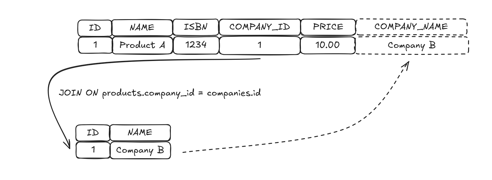

# SQL Basics: Simple JOIN
```sql
SELECT 
    products.id,
    products.name,
    products.isbn,
    products.company_id,
    products.price,
    -- Select the field in companies table and assigned a name for the field in the result
    companies.name AS company_name
FROM 
    products 
JOIN 
    -- Add the name values in companies table at the right row where id value on the company table is the same that company_id value in products table.
    companies ON products.company_id = companies.id;
```

_It seems to have the possibility to have the same result without the use of `JOIN ... ON` keyword and with the use of `WHERE` keyword._
```sql
SELECT p.*, c.name AS company_name FROM products p, companies c WHERE c.id = p.company_id
```
_But it is known as a bad practice that enhance what we call a cartesian effect. With such an implementation where we use multiple table in the `FROM` clause without an explicit join, we implicitly creating a Cartesian product (or cross join). This means every row from the products table is paired with every row from the companies table._

#### Table products
| id  | name      | company_id |
| --- | --------- | ---------- |
| 1   | Product A | 1          |
| 2   | Product B | 2          |

#### Table companies
| id  | name      |
| --- | --------- |
| 1   | Company X |
| 2   | Company Y |
| 3   | Company Z |

#### Generated table (Cartesian product)

| p.id | p.name    | p.company_id | c.id | c.name    |
| ---- | --------- | ------------ | ---- | --------- |
| 1    | Product A | 1            | 1    | Company X |
| 1    | Product A | 1            | 2    | Company Y |
| 1    | Product A | 1            | 3    | Company Z |
| 2    | Product B | 2            | 1    | Company X |
| 2    | Product B | 2            | 2    | Company Y |
| 2    | Product B | 2            | 3    | Company Z |

_So it creates a large intermediate dataset with all the pairs possibilities, leading to performance issues (For example, joining a table with 1,000 rows with another table with 1,000 rows results in 1,000,000 rows in the Cartesian product.)_

<br>

---
<br>

_I have to describe in my mind the behaviour of a join instruction to really understand that the purpose is to make a correspondance between the values of a field on a source table with the values of a field in a destination table to add these values in the result of the SQL instruction._



<br>

---
<br>

_I saw that we can use alias to reduce size of the sql instruction but for me it is more readable like that in such a simple join statement. I have to see if the alias can be really useful on more complex case._